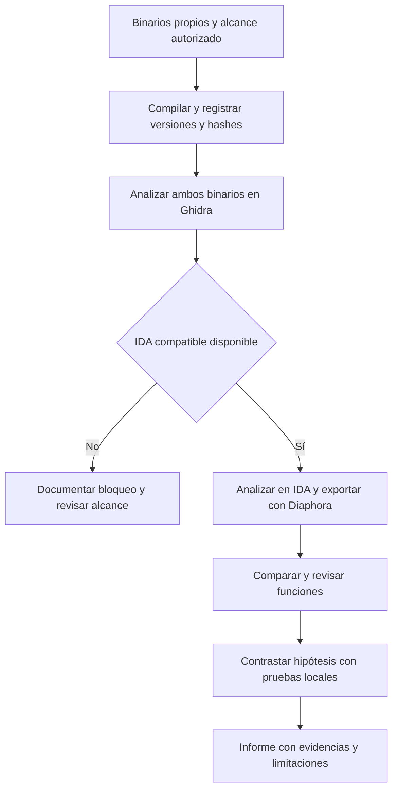

# Flujo propuesto de análisis

Diagrama propio. No representa resultados experimentales ni una integración directa entre Ghidra y Diaphora.

```mermaid
flowchart TD
    A[Binarios propios y alcance autorizado] --> B[Compilar y registrar versiones y hashes]
    B --> C[Analizar ambos binarios en Ghidra]
    C --> D{IDA compatible disponible}
    D -->|No| E[Documentar bloqueo y revisar alcance]
    D -->|Sí| F[Analizar en IDA y exportar con Diaphora]
    F --> G[Comparar y revisar funciones]
    G --> H[Contrastar hipótesis con pruebas locales]
    H --> I[Informe con evidencias y limitaciones]
```
